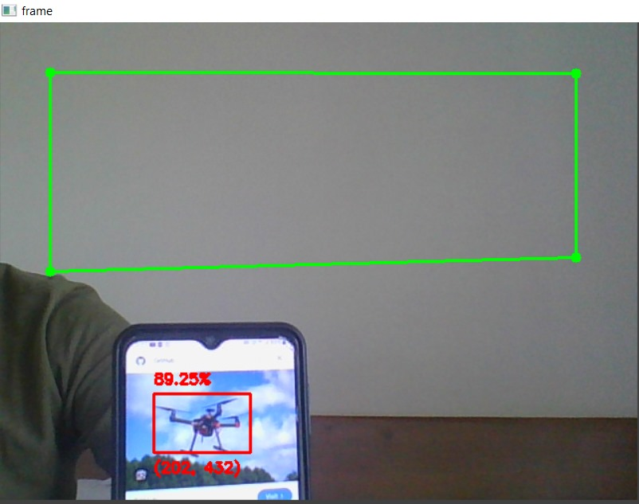
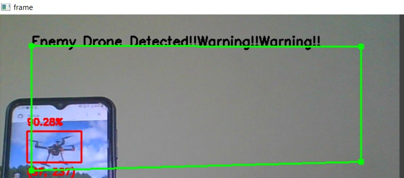
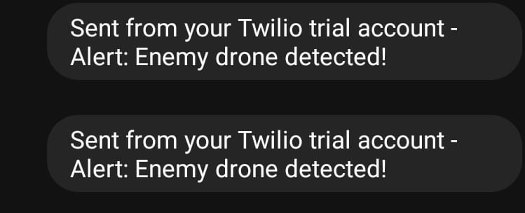

# CV_Drone_Detection_With_Alert
This project implements a real-time drone detection system using the YOLOv5 model, OpenCV for video processing, Twilio for SMS notifications, and Pygame for audio alerts. It detects drones via a webcam feed, draws bounding boxes with confidence scores and coordinates, and triggers alerts (SMS, looping audio, and video recording) when a drone enters a user-defined restricted area.

## Features
- **Real-Time Drone Detection**: Utilizes a pre-trained YOLOv5 model to detect drones in a live webcam feed.
- **Restricted Area Monitoring**: Allows users to define a draggable rectangular area to monitor for drone intrusions.
- **SMS Notifications**: Sends SMS alerts via Twilio when a drone is detected in the restricted area (with a 10-second cooldown).
- **Continuous Audio Alerts**: Plays a looping audio alert (`alert.mp3`) when a drone is detected, stopping when the drone leaves the restricted area.
- **Video Recording**: Records video clips (`drone_alert.mp4`) during detections in the restricted area.
- **Interactive UI**: Displays bounding boxes, confidence scores, coordinates, and warning messages ("Enemy Drone Detected!!Warning!!Warning!!") on the video feed.





## Prerequisites
- **Hardware**:
  - Webcam (default camera, index 0).
  - Computer with Python 3.8 or higher.
  - Audio output device (e.g., speakers) for alert sounds.
- **Software**:
  - Python libraries: `opencv-python`, `torch`, `numpy`, `pillow`, `twilio`, `pygame`.
  - YOLOv5 model weights file (`trained.pt`), trained on a drone dataset.
  - Audio file (`alert.mp3`) in the project directory.
- **Twilio Account**:
  - Sign up for a free account at [Twilio](https://www.twilio.com/try-twilio).
  - Obtain your Account SID, Auth Token, and a Twilio phone number from the Twilio Console.
  - Verify the recipient phone number in the Twilio Console (required for trial accounts).
- **Optional**:
  - `ffmpeg` for converting audio files (if `alert.mp3` needs to be converted to WAV).
  
## Installation

1. Clone the repository:
```
   git clone https://github.com/Programiz-007/CV_Drone_Detection_With_Alert.git
```
2. Inside your project directory, create a virtual environment
```
   python -m venv venv
```
3. Activate the virtual environment
```
   .\venv\Scripts\activate       
```
2. Install the required Python libraries:
```
   pip install -m requirements.txt
```
3. Run the script:
```
   python drone_detect.py
```

## Benefits
1. Enhanced Security
Real-time detection of drones for improved security in airports, public events, and restricted areas.

2. Automated Monitoring
Reduce manual surveillance by automating the drone detection process using computer vision and machine learning.

3. Customizable and Interactive
Define and adjust the detection area using an interactive rectangle for accurate and adaptable detection.

4. Real-time Feedback
Instant detection and warning messages provide immediate responses to potential drone threats.

5. Open-source and Extendable
You can access the open-source codebase for customization and integration into existing security systems.

6. Scalable and Cost-effective
Efficient utilization of resources with a balance of accuracy and performance, resulting in cost savings.

## Usage

The script will open a live video feed from the default camera.
   - To create a rectangle, click and drag the mouse on the video feed to define the four corners of the rectangle.
   - The rectangle can be adjusted by dragging the corners.
   - A warning message will be displayed whenever a drone is detected inside or near the rectangle.
   - Alert/Warning Alarm will also be triggered.
   - Alert Notification as an SMS will be received.
   - Press 'e' to exit the program.

## Customization
- Adjust the confidence threshold (`conf`) to control the sensitivity of detection.
- Try to take this to an IoT project to see real-time sensing with the help of microcontrollers and sensors.
## Troubleshooting

- **Audio Issues**:
  - **Error**: `Error playing sound: ...` or no sound.
  - **Fix**: Ensure `alert.mp3` exists in the project root and is valid. Test with a media player. Convert to WAV if needed (`ffmpeg -i alert.mp3 alert.wav`). Check system audio settings (e.g., speakers enabled).
  - **Alternative**: Use a different audio file or library (e.g., `simpleaudio`).

- **SMS Issues**:
  - **Error**: `SMS failed: ...` (e.g., "21614: Number not verified").
  - **Fix**: Verify the recipient number in Twilio Console. Ensure correct phone number format. Check Twilio logs for error codes.
  - **Cost**: Trial accounts are free but limited. Upgrade for production use.

- **Model Issues**:
  - **Error**: Detection fails or no drones detected.
  - **Fix**: Verify `best.pt` is trained on a drone dataset. Adjust confidence threshold (`conf > 0.7`) in the script if needed. Retrain with a suitable dataset if accuracy is low.

- **Webcam Issues**:
  - **Error**: Webcam feed not opening.
  - **Fix**: Ensure the webcam is connected and accessible (test with `cap = cv2.VideoCapture(0); print(cap.isOpened())`). Try index 1 or 2 (`cv2.VideoCapture(1)`).

- **Performance**:
  - **Issue**: Lag in video feed.
  - **Fix**: Reduce `size=640` to `size=416` in the script or lower the frame rate (`cv2.waitKey(10)`).

## Contributing

Contributions are welcome! To contribute:

1. Fork the repository.
2. Create a feature branch (`git checkout -b feature/YourFeature`).
3. Commit changes (`git commit -m "Add YourFeature"`).
4. Push to the branch (`git push origin feature/YourFeature`).
5. Open a pull request with a description of your changes.

Please include tests and update documentation for new features.

## License

This project is licensed under the MIT License. See the [LICENSE](LICENSE) file for details.

## Acknowledgments

- [Ultralytics YOLOv5](https://github.com/ultralytics/yolov5) for the object detection model.
- [Twilio](https://www.twilio.com) for SMS notification services.
- [Pygame](https://www.pygame.org) for audio playback.
- [OpenCV](https://opencv.org) for video processing.
